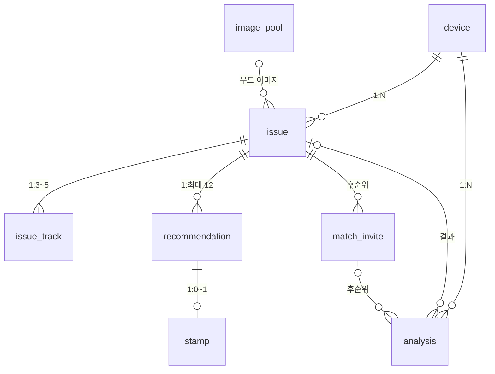

# 취향 번역기 (Taste Translator) — DB 설계서

- **문서 버전**: v1.0
- **작성일**: 2026-10-02
- **작성 기준**: 기능명세서 v1.8(최종) + API 명세서 v1.1 + 플로우차트 v4 + 와이어프레임 최종안 + 프로토타입 v1.2 + 화면 흐름 명세 v1.2

> MVP에 필요한 테이블은 8개, 후순위 테이블은 1개이다.

---

## 목차

1. [개요와 공통 규칙](#1-개요와-공통-규칙)
2. [테이블 목록과 관계](#2-테이블-목록과-관계)
3. [테이블 상세 (MVP)](#3-테이블-상세-mvp)
4. [테이블 상세 (후순위)](#4-테이블-상세-후순위)
5. [삭제 · 보관 정책과 API별 사용 테이블](#5-삭제--보관-정책과-api별-사용-테이블)
6. [부록: 테이블 생성 SQL](#6-부록-테이블-생성-sql)

---

## 1. 개요와 공통 규칙

### 1.1 기본 정보

| 항목 | 내용 |
|---|---|
| DBMS | MySQL 8 기준으로 작성(팀에서 정한 DBMS가 다르면 타입 표기만 바꾼다) |
| 문자 집합 | utf8mb4 (한글과 이모지 저장) |
| 시간 | DATETIME, 한국 시간(KST) 기준으로 저장 |
| 저장 범위 | 사용자가 만든 기록(기기, 분석, 이슈, 추천, 스탬프)과 팀이 미리 넣어 두는 데이터(향수, 이미지) |
| 저장하지 않는 것 | 영화·책·여행지 원본 데이터(외부 API에서 조회한 결과만 추천 테이블에 복사해 둔다), 이름·연락처 등 개인정보, 음악 검색어 |

### 1.2 이름 규칙

- 테이블과 컬럼 이름은 소문자 snake_case, 테이블 이름은 단수형으로 쓴다
- 기본 키는 `{테이블}_id`, 외래 키는 참조하는 테이블의 기본 키 이름을 그대로 쓴다
- 컬럼 이름은 API 응답 필드 이름과 같게 맞춘다

### 1.3 공통 타입

| 종류 | 타입 | 설명 |
|---|---|---|
| 외부에 노출되는 ID | CHAR(36) | UUID. 기기, 분석, 이슈, 추천, 초대 ID. 링크에 들어가므로 추측할 수 없는 값을 쓴다 |
| 내부 ID | BIGINT AUTO_INCREMENT | 곡, 이미지처럼 밖으로 나가지 않는 ID |
| 축 점수 | TINYINT UNSIGNED | 0~100. 8개 축을 각각 컬럼으로 둔다(`axis_energy` 등) |
| 목록 값 | JSON | 태그, 연결 근거처럼 통째로 읽고 쓰는 짧은 목록 |
| 종류 값 | ENUM | 분야, 스탬프, 분석 상태 등 정해진 값 |

8개 축 컬럼: `axis_energy`, `axis_digital`, `axis_vivid`, `axis_abstract`, `axis_cold`, `axis_novel`, `axis_social`, `axis_dramatic`. API의 `axes` 객체 키와 대응한다. 축을 JSON 하나로 묶지 않고 컬럼으로 나눈 것은 취향 연결 계산과 이슈 간 비교를 SQL로 할 수 있게 하기 위함이다.

---

## 2. 테이블 목록과 관계



기기 하나가 여러 이슈를 갖고, 이슈마다 곡 3~5건과 추천 최대 12건(분야 4개 × 3건)이 딸린다. 분석이 끝나면 이슈가 만들어지고, 무드 이미지는 이미지 풀에서 고른다.

### 2.1 테이블 목록

| No | 테이블 | 설명 | 구분 | 데이터 생성 |
|---|---|---|---|---|
| 1 | device | 익명 기기 | MVP | 앱 첫 실행 시 |
| 2 | analysis | 분석 요청과 진행 상태 | MVP | 분석 요청 시 |
| 3 | issue | 이슈(취향 프로필) | MVP | 분석 완료 시 |
| 4 | issue_track | 이슈에 쓴 곡 | MVP | 분석 완료 시 |
| 5 | recommendation | 분야별 추천 | MVP | 분석 완료 시 |
| 6 | stamp | 추천에 남긴 스탬프 | MVP | 스탬프 선택 시 |
| 7 | perfume | 향수 데이터 약 150건 | MVP | 팀이 미리 입력 |
| 8 | image_pool | 무드·여행지 이미지 약 150장 | MVP | 팀이 미리 입력 |
| 9 | match_invite | 궁합 초대와 결과 | 후순위 | 초대 생성 시 |

### 2.2 관계

| 부모 | 자식 | 관계 | 연결 컬럼 | 부모 삭제 시 |
|---|---|---|---|---|
| device | issue | 1 : N | issue.device_id | 함께 삭제 |
| device | analysis | 1 : N | analysis.device_id | 함께 삭제 |
| issue | issue_track | 1 : 3~5 | issue_track.issue_id | 함께 삭제 |
| issue | recommendation | 1 : 최대 12 | recommendation.issue_id | 함께 삭제 |
| recommendation | stamp | 1 : 0~1 | stamp.rec_id | 함께 삭제 |
| issue | analysis | 1 : 0~N | analysis.issue_id | NULL로 변경 |
| image_pool | issue | 1 : N | issue.mood_image_id | NULL로 변경 |
| perfume | recommendation | 1 : N | recommendation.source_id (외래 키 없음) | 영향 없음 |
| issue | match_invite | 1 : N | match_invite.from_issue_id, to_issue_id | 함께 삭제 / NULL로 변경 |
| match_invite | analysis | 1 : N | analysis.invite_id | NULL로 변경 |

> 향수 추천은 `recommendation.source_id`에 향수 ID를 넣지만, 이 컬럼은 분야에 따라 TMDB 영화 ID나 ISBN도 담기므로 외래 키를 걸지 않는다. 향수 정보는 추천을 만들 때 복사해 두므로, 향수 데이터가 바뀌어도 지난 이슈는 그대로 보인다.

---

## 3. 테이블 상세 (MVP)

표의 "키" 열에서 PK는 기본 키, FK는 외래 키, UQ는 중복 불가를 뜻한다.

### 3.1 device (익명 기기)

| 컬럼 | 타입 | NULL | 키 | 설명 |
|---|---|---|---|---|
| device_id | CHAR(36) | N | PK | 익명 기기 ID(UUID). 서버가 발급 |
| created_at | DATETIME | N | | 발급 일시 |

- 이름, 연락처, 토스 계정 정보는 저장하지 않는다
- 전체 기록 삭제 시 이 행을 지우면 딸린 데이터가 함께 지워진다(5.1절)

### 3.2 analysis (분석 요청과 상태)

| 컬럼 | 타입 | NULL | 키 | 설명 |
|---|---|---|---|---|
| analysis_id | CHAR(36) | N | PK | 분석 ID(UUID) |
| device_id | CHAR(36) | N | FK | 요청한 기기 |
| status | ENUM('analyzing','fetching','done','failed','canceled') | N | | 진행 상태. 기본값 analyzing |
| tracks | JSON | N | | 요청받은 곡 목록(재시도와 이슈 생성에 사용) |
| track_key | CHAR(64) | N | | 곡 조합을 나타내는 값(3.3절) |
| issue_id | CHAR(36) | Y | FK | 완료 시 만들어진 이슈 |
| invite_id | CHAR(36) | Y | FK | (후순위) 궁합 초대를 받아 분석한 경우 |
| error_code | VARCHAR(40) | Y | | 실패 사유(AI_RESPONSE_INVALID 등) |
| created_at | DATETIME | N | | 요청 일시 |
| updated_at | DATETIME | N | | 상태가 마지막으로 바뀐 일시 |

- 인덱스: (device_id, created_at)
- `canceled`는 API에 노출하지 않는 내부 상태이다. 분석 취소 시 이 값으로 바꾸고, 진행 중이던 작업은 결과를 저장하지 않는다
- 끝난 지 하루가 지난 행은 정리해도 된다(5.2절)

### 3.3 issue (이슈 · 취향 프로필)

| 컬럼 | 타입 | NULL | 키 | 설명 |
|---|---|---|---|---|
| issue_id | CHAR(36) | N | PK | 이슈 ID(UUID). 공유 링크에 사용 |
| device_id | CHAR(36) | N | FK | 소유 기기 |
| issue_no | INT | N | UQ(device_id, issue_no) | 기기별 일련번호(ISSUE 01, 02 …) |
| track_key | CHAR(64) | N | UQ(device_id, track_key) | 곡 조합을 나타내는 값 |
| taste_name | VARCHAR(60) | N | | 취향 이름(AI 생성) |
| summary | VARCHAR(300) | N | | 취향 해설 두 줄. 줄바꿈으로 구분 |
| tags | JSON | N | | 취향 키워드 4개 |
| axis_energy … axis_dramatic | TINYINT UNSIGNED | N | | 8개 축 점수(0~100). 컬럼 8개 |
| mood_image_id | BIGINT | Y | FK | 무드 이미지(image_pool). 없으면 기본 이미지 |
| ai_provider | VARCHAR(20) | N | | 분석에 쓴 제공사(openai / anthropic) |
| ai_model | VARCHAR(40) | N | | 분석에 쓴 모델 이름 |
| created_at | DATETIME | N | | 생성 일시 |

- 인덱스: (device_id, created_at) — 아카이브 최신순 조회와 홈의 최근 이슈 조회
- `track_key`는 iTunes 곡 ID를 오름차순으로 정렬해 쉼표로 이은 문자열의 SHA-256 값이다. 같은 기기에서 같은 곡 조합으로 다시 분석하면 이 값으로 기존 이슈를 찾아 재사용한다
- `issue_no`는 그 기기의 가장 큰 번호 + 1로 매긴다

### 3.4 issue_track (이슈에 쓴 곡)

| 컬럼 | 타입 | NULL | 키 | 설명 |
|---|---|---|---|---|
| issue_track_id | BIGINT | N | PK | 자동 증가 |
| issue_id | CHAR(36) | N | FK | 소속 이슈 |
| position | TINYINT | N | UQ(issue_id, position) | 선택 순서(1~5) |
| track_id | BIGINT | N | UQ(issue_id, track_id) | iTunes 곡 ID |
| title | VARCHAR(200) | N | | 곡명 |
| artist | VARCHAR(200) | N | | 아티스트 |
| artwork_url | VARCHAR(500) | Y | | 앨범 아트 주소 |
| genre | VARCHAR(60) | Y | | 장르 |

- `position`이 1인 곡이 홈과 아카이브의 "대표 곡 외 n곡"에 쓰인다

### 3.5 recommendation (분야별 추천)

| 컬럼 | 타입 | NULL | 키 | 설명 |
|---|---|---|---|---|
| rec_id | CHAR(36) | N | PK | 추천 ID(UUID) |
| issue_id | CHAR(36) | N | FK | 소속 이슈 |
| category | ENUM('movie','book','travel','perfume') | N | UQ(issue_id, category, rank) | 분야 |
| rank | TINYINT | N | | 분야 내 순번(1~3). 1이 대표 추천 |
| source | ENUM('tmdb','kakao_book','opentripmap','perfume_db') | N | | 정보 출처 |
| source_id | VARCHAR(64) | N | | 출처에서의 ID(TMDB 영화 ID, ISBN, 영문 장소 이름, 향수 ID) |
| title | VARCHAR(200) | N | | 추천 대상 이름 |
| meta | VARCHAR(200) | N | | 분야별 한 줄 정보 |
| description | VARCHAR(300) | Y | | 소개 1~2문장 |
| image_url | VARCHAR(500) | Y | | 대표 이미지 주소 |
| axis_energy … axis_dramatic | TINYINT UNSIGNED | N | | AI가 매긴 대상의 8개 축 점수. 컬럼 8개 |
| match_score | TINYINT UNSIGNED | N | | 취향 연결 점수(60~99) |
| reason | VARCHAR(300) | N | | 추천 이유 1~2문장 |
| mappings | JSON | N | | 연결 근거 3줄. `[{"music":"…","target":"…"}]` |
| evidence | VARCHAR(400) | N | | 고른 곡 이름이 들어간 근거 문장 |
| tags | JSON | N | | 추천 대상 키워드 1~3개 |
| created_at | DATETIME | N | | 생성 일시 |

- 외부 API에서 조회한 제목·메타·이미지를 여기에 복사해 둔다. 지난 이슈를 열 때 외부 API를 다시 호출하지 않는다
- `rank`는 MySQL 예약어이므로 SQL에서 백틱으로 감싼다
- 조회에 실패한 분야는 행이 없다. 조회에 성공한 후보가 3건보다 적으면 찾은 만큼만 저장한다

### 3.6 stamp (스탬프)

| 컬럼 | 타입 | NULL | 키 | 설명 |
|---|---|---|---|---|
| rec_id | CHAR(36) | N | PK, FK | 대상 추천. 추천당 1건 |
| stamp | ENUM('love','near','unsure','no') | N | | 스탬프 종류 |
| created_at | DATETIME | N | | 처음 남긴 일시 |
| updated_at | DATETIME | N | | 마지막으로 바꾼 일시 |

- 다시 선택하면 같은 행을 갱신한다
- 기록·표시용이며 분석과 추천에 쓰지 않는다

### 3.7 perfume (향수)

| 컬럼 | 타입 | NULL | 키 | 설명 |
|---|---|---|---|---|
| perfume_id | VARCHAR(20) | N | PK | 향수 ID(예: P001). AI에 목록으로 보내는 값 |
| name | VARCHAR(100) | N | | 향수 이름 |
| brand | VARCHAR(100) | N | | 브랜드 |
| family | VARCHAR(40) | N | | 계열(우디, 플로럴, 시트러스 등) |
| notes | JSON | N | | 주요 노트 목록 |
| image_url | VARCHAR(500) | Y | | 제품 이미지 주소 |

### 3.8 image_pool (무드 · 여행지 이미지)

| 컬럼 | 타입 | NULL | 키 | 설명 |
|---|---|---|---|---|
| image_id | BIGINT | N | PK | 자동 증가 |
| file_name | VARCHAR(100) | N | UQ | 장소_특징_분위기 순서의 파일 이름(예: kyoto_alley_night). AI에 목록으로 보내는 값 |
| image_url | VARCHAR(500) | N | | 이미지 주소 |
| kind | ENUM('place','mood') | N | | place(특정 장소) / mood(분위기 일반) |

- 이슈의 무드 이미지는 `issue.mood_image_id`로 참조한다
- 여행지 추천의 이미지는 고른 파일의 주소를 `recommendation.image_url`에 복사한다

---

## 4. 테이블 상세 (후순위)

MVP에서는 만들지 않는다. 친구 궁합을 개발할 때 추가한다.

### 4.1 match_invite (궁합 초대와 결과)

| 컬럼 | 타입 | NULL | 키 | 설명 |
|---|---|---|---|---|
| invite_id | CHAR(36) | N | PK | 초대 ID(UUID). 초대 링크에 사용 |
| from_issue_id | CHAR(36) | N | FK | 보낸 사람의 이슈 |
| from_nickname | VARCHAR(8) | N | | 보낸 사람 별명. 기본값 '친구' |
| to_issue_id | CHAR(36) | Y | FK | 친구의 이슈. 친구가 분석을 마치면 채운다 |
| score | TINYINT UNSIGNED | Y | | 일치율(0~100) |
| summary | VARCHAR(200) | Y | | 두 사람 취향 비교 한 줄 |
| same_tags | JSON | Y | | 겹치는 키워드 |
| diff_tags | JSON | Y | | 다른 키워드 |
| together_title | VARCHAR(200) | Y | | 함께 볼 영화 제목 |
| together_image_url | VARCHAR(500) | Y | | 함께 볼 영화 포스터 주소 |
| together_reason | VARCHAR(200) | Y | | 한 줄 이유 |
| seen_by_sender | BOOLEAN | N | | 보낸 사람이 결과를 확인했는지. 기본값 false |
| created_at | DATETIME | N | | 생성 일시 |
| expires_at | DATETIME | N | | 만료 일시(생성 후 7일) |

- 인덱스: (from_issue_id), (to_issue_id)
- `to_issue_id`가 채워져 있고 `seen_by_sender`가 false인 초대가 있으면, 보낸 사람의 홈에 "궁합이 도착했어요"를 표시한다
- API 명세서 4.3절의 `together_rec.rec_id`는 이 설계에서 따로 두지 않았다. 함께 볼 추천의 상세 화면이 필요하면 `recommendation`에 행을 만들고 여기서 참조하도록 바꾼다

### 4.2 취향 변화

취향 변화 비교는 새 테이블이 필요 없다. `issue`의 8개 축 컬럼 두 행을 읽어 비교한다.

---

## 5. 삭제 · 보관 정책과 API별 사용 테이블

### 5.1 전체 기록 삭제

`DELETE /devices/me`가 호출되면 `device` 행 하나를 지운다. 외래 키의 연쇄 삭제(ON DELETE CASCADE)로 아래가 함께 지워진다.

1. device 삭제
2. 그 기기의 analysis, issue 삭제
3. 이슈에 딸린 issue_track, recommendation 삭제
4. 추천에 딸린 stamp 삭제
5. (후순위) 그 이슈로 보낸 match_invite 삭제. 친구로 참여한 초대는 `to_issue_id`만 NULL로 바뀐다

- 삭제는 되돌릴 수 없다. 삭제 표시만 하고 남겨 두는 방식은 쓰지 않는다(개인정보 처리방침의 "언제든 모든 기록을 삭제"에 맞춤)
- perfume과 image_pool은 사용자 데이터가 아니므로 지워지지 않는다

### 5.2 보관 기간

| 테이블 | 보관 |
|---|---|
| device, issue, issue_track, recommendation, stamp | 사용자가 삭제할 때까지 |
| analysis | 끝난 지 하루가 지나면 정리 가능(이슈가 이미 만들어져 있어 다시 쓰지 않음) |
| match_invite | 만료 후에도 결과가 있으면 보관. 결과 없이 만료된 초대는 정리 가능 |
| perfume, image_pool | 계속 보관. 팀이 직접 수정 |

### 5.3 API별 사용 테이블

| API | 읽기 | 쓰기 |
|---|---|---|
| POST /devices | | device |
| DELETE /devices/me | | device(연쇄 삭제) |
| GET /home | issue, issue_track, image_pool, match_invite(후순위) | |
| POST /analyses | issue(같은 곡 조합 확인) | analysis |
| (분석 작업) | perfume, image_pool | analysis, issue, issue_track, recommendation |
| GET /analyses/{id} | analysis | |
| DELETE /analyses/{id} | | analysis |
| GET /issues | issue, issue_track, image_pool | |
| GET /issues/{id} | issue, issue_track, image_pool | |
| GET /issues/{id}/recommendations | recommendation, stamp | |
| GET /recommendations/{id} | recommendation, stamp | |
| PUT /recommendations/{id}/stamp | recommendation | stamp |
| POST /matches (후순위) | issue | match_invite |
| GET /matches/{id} (후순위) | match_invite, issue | |
| GET /matches/{id}/result (후순위) | match_invite, issue | match_invite(확인 표시) |
| GET /issues/changes (후순위) | issue | |

> 분석 작업의 쓰기(issue, issue_track, recommendation 생성과 analysis 완료 처리)는 하나의 트랜잭션으로 묶는다. 중간에 실패하면 반쪽짜리 이슈가 남지 않게 한다.

---

## 6. 부록: 테이블 생성 SQL

MySQL 8 기준이다. MVP 테이블 8개를 참조 순서대로 만든다.

```sql
CREATE TABLE device (
  device_id  CHAR(36) NOT NULL,
  created_at DATETIME NOT NULL DEFAULT CURRENT_TIMESTAMP,
  PRIMARY KEY (device_id)
) DEFAULT CHARSET = utf8mb4;

CREATE TABLE image_pool (
  image_id  BIGINT NOT NULL AUTO_INCREMENT,
  file_name VARCHAR(100) NOT NULL,
  image_url VARCHAR(500) NOT NULL,
  kind      ENUM('place','mood') NOT NULL,
  PRIMARY KEY (image_id),
  UNIQUE KEY uq_image_file_name (file_name)
) DEFAULT CHARSET = utf8mb4;

CREATE TABLE perfume (
  perfume_id VARCHAR(20) NOT NULL,
  name       VARCHAR(100) NOT NULL,
  brand      VARCHAR(100) NOT NULL,
  family     VARCHAR(40) NOT NULL,
  notes      JSON NOT NULL,
  image_url  VARCHAR(500) NULL,
  PRIMARY KEY (perfume_id)
) DEFAULT CHARSET = utf8mb4;

CREATE TABLE issue (
  issue_id      CHAR(36) NOT NULL,
  device_id     CHAR(36) NOT NULL,
  issue_no      INT NOT NULL,
  track_key     CHAR(64) NOT NULL,
  taste_name    VARCHAR(60) NOT NULL,
  summary       VARCHAR(300) NOT NULL,
  tags          JSON NOT NULL,
  axis_energy   TINYINT UNSIGNED NOT NULL,
  axis_digital  TINYINT UNSIGNED NOT NULL,
  axis_vivid    TINYINT UNSIGNED NOT NULL,
  axis_abstract TINYINT UNSIGNED NOT NULL,
  axis_cold     TINYINT UNSIGNED NOT NULL,
  axis_novel    TINYINT UNSIGNED NOT NULL,
  axis_social   TINYINT UNSIGNED NOT NULL,
  axis_dramatic TINYINT UNSIGNED NOT NULL,
  mood_image_id BIGINT NULL,
  ai_provider   VARCHAR(20) NOT NULL,
  ai_model      VARCHAR(40) NOT NULL,
  created_at    DATETIME NOT NULL DEFAULT CURRENT_TIMESTAMP,
  PRIMARY KEY (issue_id),
  UNIQUE KEY uq_issue_no (device_id, issue_no),
  UNIQUE KEY uq_issue_tracks (device_id, track_key),
  KEY idx_issue_device_created (device_id, created_at),
  CONSTRAINT fk_issue_device FOREIGN KEY (device_id)
    REFERENCES device (device_id) ON DELETE CASCADE,
  CONSTRAINT fk_issue_image FOREIGN KEY (mood_image_id)
    REFERENCES image_pool (image_id) ON DELETE SET NULL
) DEFAULT CHARSET = utf8mb4;

CREATE TABLE issue_track (
  issue_track_id BIGINT NOT NULL AUTO_INCREMENT,
  issue_id       CHAR(36) NOT NULL,
  position       TINYINT NOT NULL,
  track_id       BIGINT NOT NULL,
  title          VARCHAR(200) NOT NULL,
  artist         VARCHAR(200) NOT NULL,
  artwork_url    VARCHAR(500) NULL,
  genre          VARCHAR(60) NULL,
  PRIMARY KEY (issue_track_id),
  UNIQUE KEY uq_track_position (issue_id, position),
  UNIQUE KEY uq_track_once (issue_id, track_id),
  CONSTRAINT fk_track_issue FOREIGN KEY (issue_id)
    REFERENCES issue (issue_id) ON DELETE CASCADE
) DEFAULT CHARSET = utf8mb4;

CREATE TABLE analysis (
  analysis_id CHAR(36) NOT NULL,
  device_id   CHAR(36) NOT NULL,
  status      ENUM('analyzing','fetching','done','failed','canceled')
              NOT NULL DEFAULT 'analyzing',
  tracks      JSON NOT NULL,
  track_key   CHAR(64) NOT NULL,
  issue_id    CHAR(36) NULL,
  invite_id   CHAR(36) NULL,
  error_code  VARCHAR(40) NULL,
  created_at  DATETIME NOT NULL DEFAULT CURRENT_TIMESTAMP,
  updated_at  DATETIME NOT NULL DEFAULT CURRENT_TIMESTAMP
              ON UPDATE CURRENT_TIMESTAMP,
  PRIMARY KEY (analysis_id),
  KEY idx_analysis_device_created (device_id, created_at),
  CONSTRAINT fk_analysis_device FOREIGN KEY (device_id)
    REFERENCES device (device_id) ON DELETE CASCADE,
  CONSTRAINT fk_analysis_issue FOREIGN KEY (issue_id)
    REFERENCES issue (issue_id) ON DELETE SET NULL
) DEFAULT CHARSET = utf8mb4;

CREATE TABLE recommendation (
  rec_id        CHAR(36) NOT NULL,
  issue_id      CHAR(36) NOT NULL,
  category      ENUM('movie','book','travel','perfume') NOT NULL,
  `rank`        TINYINT NOT NULL,
  source        ENUM('tmdb','kakao_book','opentripmap','perfume_db') NOT NULL,
  source_id     VARCHAR(64) NOT NULL,
  title         VARCHAR(200) NOT NULL,
  meta          VARCHAR(200) NOT NULL,
  description   VARCHAR(300) NULL,
  image_url     VARCHAR(500) NULL,
  axis_energy   TINYINT UNSIGNED NOT NULL,
  axis_digital  TINYINT UNSIGNED NOT NULL,
  axis_vivid    TINYINT UNSIGNED NOT NULL,
  axis_abstract TINYINT UNSIGNED NOT NULL,
  axis_cold     TINYINT UNSIGNED NOT NULL,
  axis_novel    TINYINT UNSIGNED NOT NULL,
  axis_social   TINYINT UNSIGNED NOT NULL,
  axis_dramatic TINYINT UNSIGNED NOT NULL,
  match_score   TINYINT UNSIGNED NOT NULL,
  reason        VARCHAR(300) NOT NULL,
  mappings      JSON NOT NULL,
  evidence      VARCHAR(400) NOT NULL,
  tags          JSON NOT NULL,
  created_at    DATETIME NOT NULL DEFAULT CURRENT_TIMESTAMP,
  PRIMARY KEY (rec_id),
  UNIQUE KEY uq_rec_rank (issue_id, category, `rank`),
  CONSTRAINT fk_rec_issue FOREIGN KEY (issue_id)
    REFERENCES issue (issue_id) ON DELETE CASCADE
) DEFAULT CHARSET = utf8mb4;

CREATE TABLE stamp (
  rec_id     CHAR(36) NOT NULL,
  stamp      ENUM('love','near','unsure','no') NOT NULL,
  created_at DATETIME NOT NULL DEFAULT CURRENT_TIMESTAMP,
  updated_at DATETIME NOT NULL DEFAULT CURRENT_TIMESTAMP
             ON UPDATE CURRENT_TIMESTAMP,
  PRIMARY KEY (rec_id),
  CONSTRAINT fk_stamp_rec FOREIGN KEY (rec_id)
    REFERENCES recommendation (rec_id) ON DELETE CASCADE
) DEFAULT CHARSET = utf8mb4;
```

- `analysis.invite_id`의 외래 키는 후순위인 match_invite 테이블을 만들 때 함께 추가한다
- 이 SQL은 실행해 보지 않았다. 개발 DB에서 한 번 실행해 확인한다
